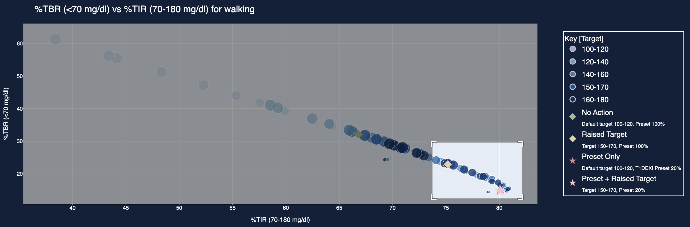

# T1D-PA-Intervention-Visualization

This repository provides a script for visualizing the effects of preset- and target-based insulin interventions during physical activity (PA) in individuals with type 1 diabetes.

The simulations leverage the [Tidepool Type 1 Diabetes Metabolism Simulator](https://github.com/tidepool-org/data-science-simulator), integrated with a PA model derived from the Type 1 Diabetes Exercise Initiative (T1DEXI) [\[1\]](#references) data.

# Table of Contents

- [Simulation Design](#simulation-design)
- [Intervention Strategy](#intervention-strategy)
- [Simulation Analysis](#simulation-analysis)
- [Visualization Instructions](#visualization-instructions)
- [References](#references)

## Simulation Design

Simulations were structured to begin 1 hour prior to the onset of physical activity, followed by either a 30- or 60-minute PA session, and continued for 3 hours post-activity.

Simulations were conducted across a range of initial conditions, activity types, and intervention settings, as detailed below:

1. **Initial Glucose Concentration**: Varied from 70 to 250 mg/dL in 20 mg/dL increments.

2. **Net Insulin on Board (netIoB)**: Varied from 0 to 3 units, simulated via manual bolus administration.

3. **Exercise Duration**: 30 or 60 minutes.

4. **Activity Type**: Walking, biking, jogging, or strength training, each modeled with activity-specific physiological parameters identified from T1DEXI data.

<!-- 5. **Virtual Patients**: 10 adult virtual patients with varying insulin sensitivity factors (ISF), carbohydrate-to-insulin ratios (CIR), and basal insulin rates. -->
5. **Virtual Patients**: 1 adult virtual patient with an insulin sensitivity factors (ISF) of 23, carbohydrate-to-insulin ratios (CIR) of 6, and basal insulin rate of 1.15.

5. **Patient-Controller Mismatch Scenarios**: To account for real-world variability in parameter estimation, three conditions were simulated:

* No noise: controller and patient ISF, CIR, and basal rates are identical.

* Uniformly sampled noise: uniformly sampled noise (0–25%) added independently to each controller setting.

* 25%: ±25% noise added independently to each controller setting.


## Intervention Strategy
Preset and target interventions were initiated 1 hour prior to activity and maintained through the end of the session.

* **Preset**: Varied from 10% to 200%, in 10% increments.
* **Glucose Target Settings**: Varied as 100–120 mg/dL, 120–140 mg/dL, up to 160–180 mg/dL, with an additional setting of 150–170 mg/dL corresponding to recommended PA target.

Across all settings and scenarios, a total of **96,000** simulations were performed.

## Simulation Analysis
For each simulation, the following metrics were calculated:

| Metric          | Description                                 |
|-----------------|---------------------------------------------|
| %TIR (70–180 mg/dl)   | % Time in Range (70–180 mg/dL)              |
| %TBR (<70 mg/dl)      | % Time Below Range (<70 mg/dL)              |
| %TBR (<54 mg/dl)      | % Time Below Range (<54 mg/dL)              |
| %TAR (>180 mg/dl)     | % Time Above Range (>180 mg/dL)             |
| LBGI            | Low Blood Glucose Index              |
| HBGI            | High Blood Glucose Index             |
| BGRI            | Blood Glucose Risk Index             |
| Magni Risk            | Magni Risk             |


Each metric was evaluated across different analysis windows, defined relative to the time of physical activity:
* Start times: 1 hour prior to activity, start of activity, or end of activity.
* End times: Start of activity, end of activity, 1 hour post-activity, 2 hours post-activity, or 3 hours post-activity.

Further, to visualize metrics across multiple sessions, two aggregation approaches were used:
* **Unweighted Average**: Each simulation session contributed equally
* **Weighted Average**: Each session was weighted according to the starting glucose distribution observed in the T1DEXI dataset

## Visualization Instructions  

To launch the visualization tool, run the following command:

```bash
python visualize_results.py
```

After running the script, open the address displayed in your terminal in a web browser.

The visualization interface provides options to select:

* Activity type

* Activity duration

* Noise level

* Starting glucose range

* Maximum net insulin on board (netIoB)

* Evaluation window duration

* Averaging method (unweighted or weighted)

* Two metrics to display in the plot

Below is an example screenshot of the tool illustrating the available controls:


**Figure 1:** Visualization tool interface showing available options for selecting simulation parameters, evaluation settings, and output metrics.


The generated plots are interactive: hovering over any data point displays detailed information about the corresponding target and preset intervention settings, as well as the associated metric values.


**Figure 2:** Example of information displayed when hovering over a data point.

Individual areas of the plot can also be zoomed in to facilitate finer analysis.

<p float="left">
  
  
</p>

**Figure 3:** Example of zooming into specific areas in the plot.

## References
[1] Riddell, Michael C., et al. "Examining the acute glycemic effects of different types of structured exercise sessions in type 1 diabetes in a real-world setting: the type 1 diabetes and exercise initiative (T1DEXI)." Diabetes care 46.4 (2023): 704-713.


